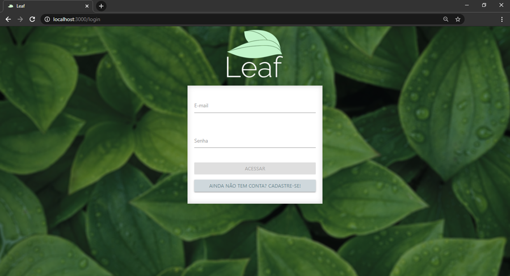
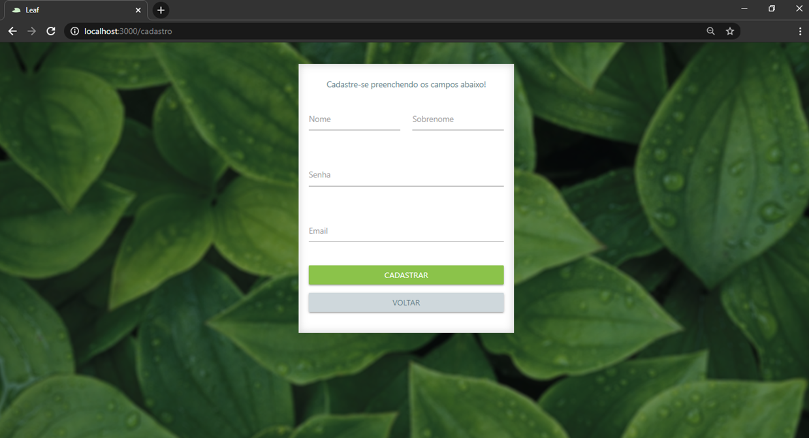
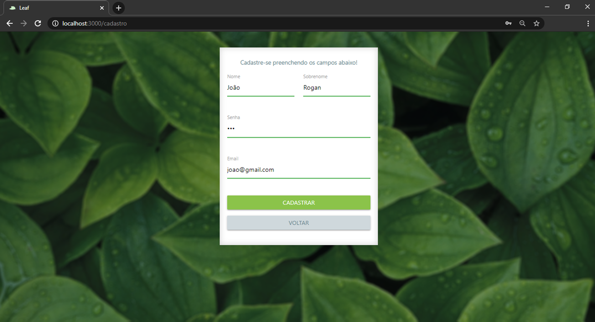
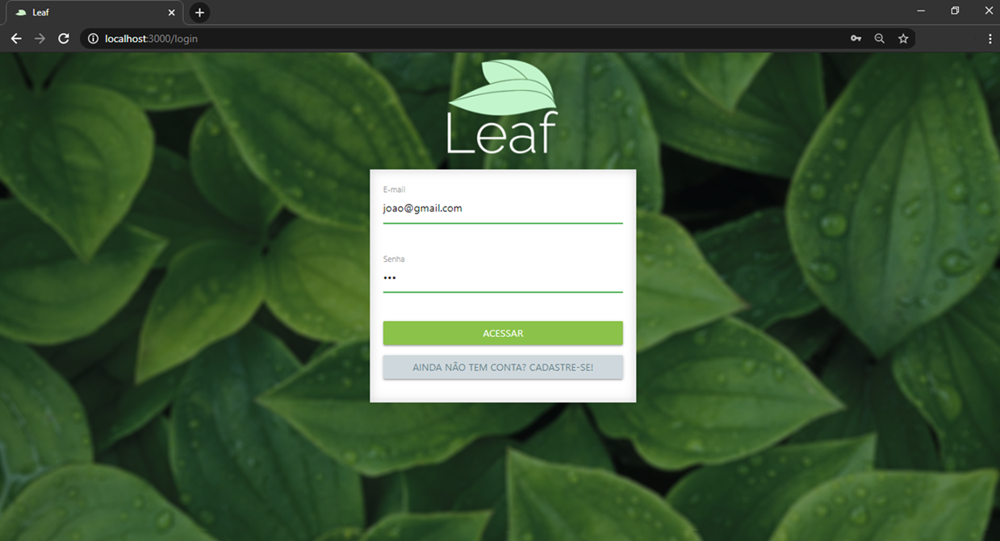
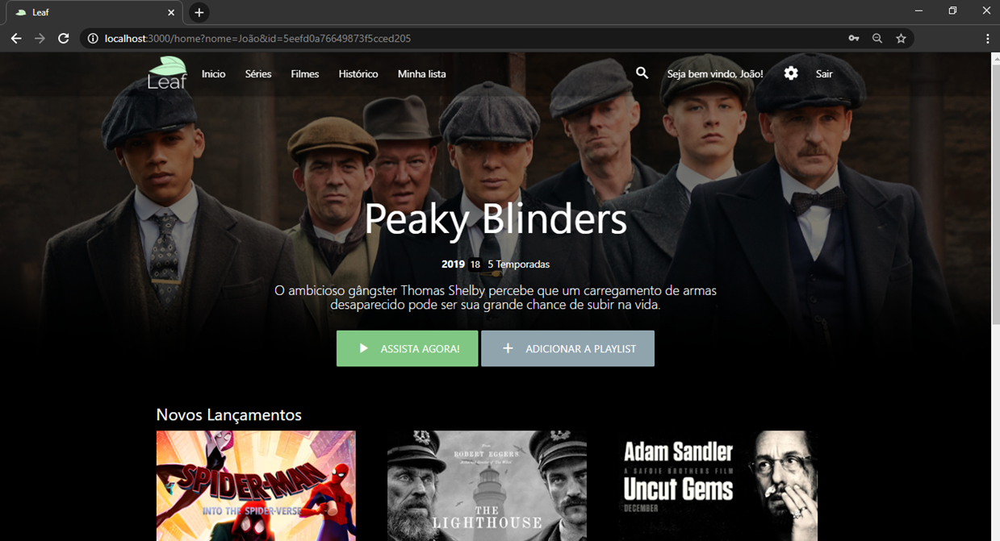
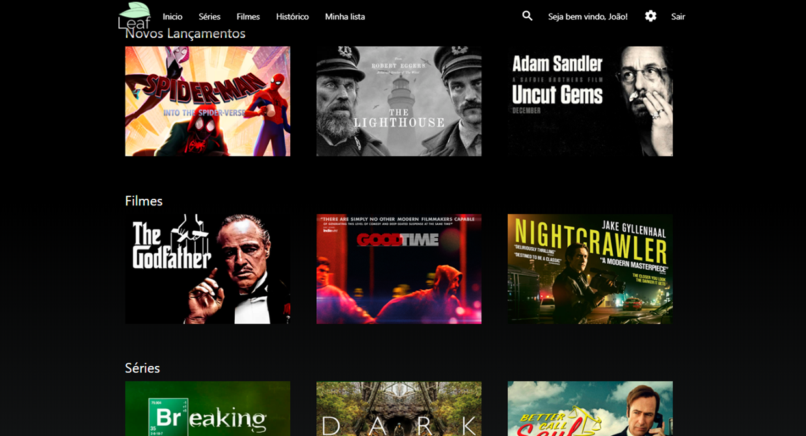

<p align="center">  </p>

Leaf é um serviço de streaming similar a Netflix desenvolvido para um trabalho de Engenharia de Software. 

Para assistir um curto vídeo de apresentação do projeto no Youtube [clique aqui.](https://youtu.be/V8Dy22f9jS4)


# Rodando o Projeto

1. Abrir a pasta do projeto no Visual Studio.
2. Instalar o [MongoDB](https://www.mongodb.com/try/download/community) na máquina.

### Instalando 

1. Instalar pacotes do NPM
   ```sh 
    npm install
   ```
      
2. Selecionar o caminho do banco de dados (Caminho da instalação do mongoDB --dbpath caminho da pasta data/db do projeto)
     
    > 'C:\'Program Files'\MongoDB\Server\4.2\bin\mongod.exe –dbpath "C:\Users\Lucas\Desktop\Leaf\Leaf_c\data\db'
    

3. Realizar as preparações necessárias para executar o projeto.
    ```sh 
    npm run build 
    ```

4. Executar o projeto. 
    ```sh
    npm start
    ```

### Visualizando o Projeto

1. Depois de executar todos esses comandos, basta acessar o

   ```sh
   http://localhost:3000/
   ```
2. Ao acessar você será direcinado para a página inicial.


3. Se já possuir conta, basta efetuar login, caso contrário clique no botão para efetuar o cadastro e você será redirecionado para a seguinte página. 




4. Depois de efetuar o cadastro você é redirecionado para a tela incial para realizar o login. 



5. Após efetuar o login, você será redirecionado para a página principal do site.





